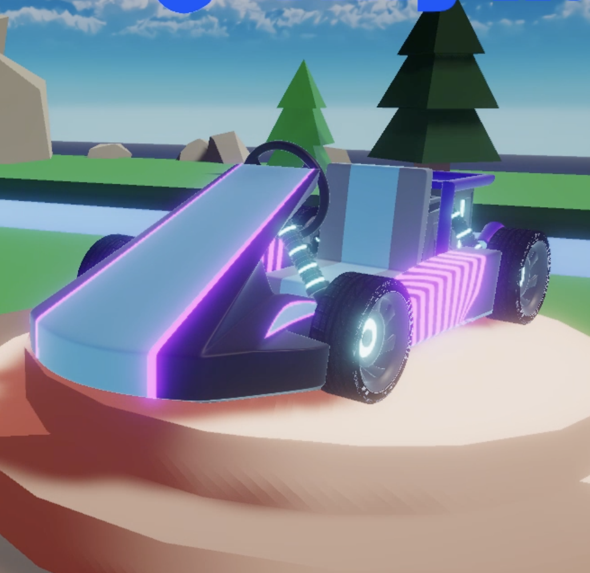

# Tiny Karts (2022)

 

Tiny Karts is a small Time Trial Racing Game that was developed for Sinclair College's Tech Prep Showcase. Tiny Karts was created using C# and Unity 3D's Universal Render Pipeline. This README contains how each of the scripts within Tiny Karts works as well as some future changes.
- Unity Version: 2020.3.25f1
## Table of Contents
- [Go-Kart Controller](#go-kart-controller)
- [Camera Controller](#camera-controller)
- [Level Select](#level-select)
- [Lap System](#lap-system)
- [Game Settings](#game-settings)

# Go-Kart Controller
## Description
The Go-Kart Controller Script handles user input, and the go-kart movement. The script achieves the movement by using an invisible sphere and snapping the visual object of the go-kart to the position of the invisible sphere. 
## Methods
### Start
The Start method is called at the beginning of a scene.
- Within Start, the method un-parents the go-karts model from the sphere to ensure that the model remains upright.
### Update
The Update Method is called once every frame.
- Update gets the value of the vertical input (W,D | 1, -1) and multiplies this value by a set Acceleration Float and stores it in speedInput. 
- After getting the vertical input and the horizontal input (A,S | -1, 1), the Update method rotates the go-kart object around its y-axis depending on the horizontal input if the go-kart is touching the ground. This also done for the 2 front wheels but the wheels are not dependant on if they are touching the ground.
- Finally, the Update method sets the position of the go-kart model on to the position of the sphere.
### FixedUpdate
The Fixed Update Method is called once every FixedFrame. This can be adjusted in Edit > Settigns > Time > Fixed Timestep.
- Using a Physics.Raycast the FixedUpdate Method checks to see if the sphere controller the go-kart is on the ground.
- If the go-kart is on the ground, the speedInput is applied as a force to the rigidBody component of the sphere.
- If the go-kart is not on the ground, just the value of -9.8f * the mass of the go-kart is applied as gravity to the rigidbody.

# Camera Controller
## Description
The Camera Controller Script allows for the camera to look at and follow the go-kart model around as the sphere controlling the go-kart moves.
## Methods
### Awake
Awake is called after all active GameObjects in a Scene are initialized.
- Within the Awake method, it finds the player's GameObject, camLookAt/camFollow's (Front and Back for both) GameObject.
### Update
The Update Method is called once every frame.
- The Update method is used to call both the Follow and LookAt methods every frame.
### Follow
The Follow method is used to determine which point the camera is following.
- If the vertical input of the player is greater than 0, then the camera is going to follow the back of the go-kart so that the view points towards the front
- If the vertical input of the player is less than 0, then the camera is going to follow the front of the go-kart so that the rear of the go-kart is pointing towards the direction the player is driving. 
- Both of these are done gradually so that the camera does not snap to the new position, this is accomplished with a Vector3.Lerp().
### LookAt
The LookAt method is similiar to the Follow method in determining what point the camera is looking at.
- If the vertical input is greater than 0 then the camera is looking at back of the go-kart.
- If the vertical input is less than 0 then the camera is looking at the front of the go-kart.

# Level Select
## Description
The Level Select script is used to load the different tracks the player is able to race on.
## Methods
### The Level Select script has 9 public methods that are used by the UI to load the different scenes.
- Each of these methods loads the specific map corresponding to the scene name.
## Changes
If the Level Select script is to be re-written, 1 method would be needed with an argument containing the name of the scene the player is trying to switch to.

# Lap System
## Description
The Lap System keeps track of both the direct previous lap time and the current lap time as well as the current lap number out of 3.
## LapTimeManager Class
The LapTimeManager Class counts upward using Time.deltaTime multiplied by a value (10f for milliseconds) to count from milliseconds through minutes. This is then set on to the UI.
## HalfPointTrigger Class
This class has a method named OnTriggerEnter that sets the GameObject actuve that the LapComplete Class is attached to, while also turning its own GameObject off.
## LapComplete Class
The LapComplete class handles the incrementation of the Lap Counter. This class also handles copying the current lap time over to the previous lap time and resets the current time.

# Game Settings
## Description
The Game Settings System has 2 classes, QualitySettings and fpsLimit.
## Methods
### SetQuality
The SetQuality method take the index of the dropdown menu and changes the game's visual quality to match.
### ChangeFramerate
The ChangeFramerate method changes the applications target framerate to the user specified amount. The default value for the frame rate is 60.
